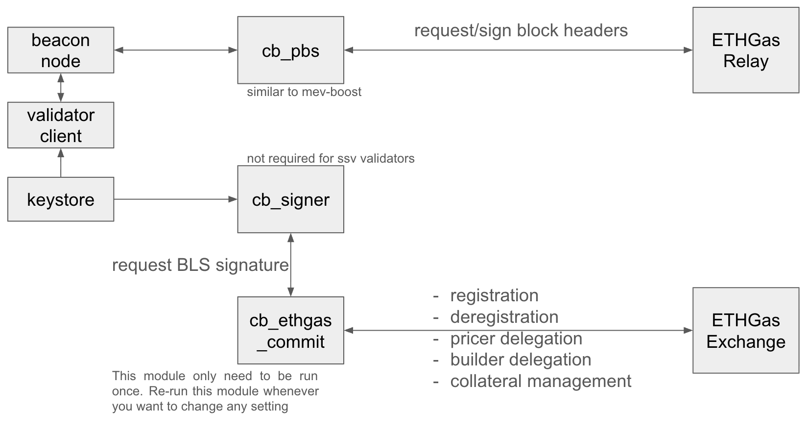

## Overview
First and foremost, we would like to give a big shout out to the Commit-Boost team for making Ethereum a more open and cooperative environment! This repo allows you to run all Commit-Boost components related to ETHGas in Docker. There are 3 main components, i.e.
* `cb_pbs`: It serves a similar purpose as MEV-Boost. To avoid validators being slashed because of signing a block without preconf, please only set relays that are approved by ETHGas.
* `cb_signer`: It securely generates signatures from the validator BLS private keys
* `cb_ethgas_commit`: It requests signatures for ETHGas registration from `cb_signer` where the signatures are then sent to the ETHGas Exchange via REST API


## Build docker images
* For `cb_ethgas_commit` and `cb_gen_jwt`, you can either use our pre-built linux/amd64 or linux/arm64 docker image or run `./scripts/build.sh` to build it locally
* For `cb_signer` and `cb_pbs`, you can either use the official image from Commit Boost team or use Dockerfile [here](https://github.com/Commit-Boost/commit-boost-client/tree/main/provisioning) to build it locally

## Config Setup
* Copy one of the `config.example.xxx.toml` as `config.toml`
* Copy `docker-compose-example.yml` as `docker-compose.yml`
* Create an empty `.cb.env` file and run `docker-compose -f docker-compose.yml up cb_gen_jwt` to generate new jwt for the signer module
* Do not use any other relay than the one listed in the `config.example.xxx.toml`, otherwise you will get slashed
* Registration of SSV validators can skip signer-related setup below
* For local signer module, Commit Boost supports Lighthouse, Prysm, Teku and Lodestar's keystores. Please refer to [here](https://commit-boost.github.io/commit-boost-client/get_started/configuration#local-signer) for more details
    * `format`, `keys_path` and `secrets_path` are used together and cannot be used together with `key_path` (key without s)
* For remote signer module, Commit Boost supports Web3Signer and Dirk. Please refer to [here](https://commit-boost.github.io/commit-boost-client/get_started/configuration#remote-signer) for more details
* Set ETHGas Commit module config in `config.toml`
    * under `[[modules]]` section where `id = ETHGAS_COMMIT`,
    * set your `entity_name`
    * set `registration_mode` to be either `standard` for the most typical validators, `fabric` for registration flow via Fabric Universal Registry Contract, `ssv` for SSV validatorsor `skipped` to skip registration
        * `fabric` is still an experimental option for proof of concept only
    * set `urc_addr` if `registration_mode = "fabric"`
    * set `enable_registration = true` to register validators in ETHGas, set `enable_registration = false` to de-register validators
    * By default, all validator public keys inside keys directory or file will be registered in ETHGas Exchange. If `[[mux]]` section with `id` under `[[mux.relays]]` contains `ethgas` wording in the config, then only those `validator_pubkeys` will be registered.
    * since your EOA address is required to be registered in ETHGas Exchange by generating a EIP712 signature first, then your validator public key can be binded to your EOA address by generating a BLS signature. You will need to either set `is_jwt_provided = false` and `eoa_signing_key` in `config.toml` or you can refer to our API doc [this part](https://developers.ethgas.com/?http#post-api-v1-user-login) and [this part](https://developers.ethgas.com/?http#post-api-v1-user-login-refresh) to get access & refresh jwt and set `is_jwt_provided = true` and `access_jwt` & `refresh_jwt` in `config.toml` 
        * Alternatively, you can set `EOA_SIGNING_KEY` or `ACCESS_JWT` & `REFRESH_JWT` as env variables in `.cb.env`
    * set `enable_pricer = true` if you want to delegate to our default pricer to help you to sell preconfs
    * set `enable_builder = true` and `builder_pubkey` if you want to delegate to a specific external builder to build the block. Regardless of whether the builder delegation is enabled or not, our fallback builder will always build a backup block which can fulfill all the preconf commitments
    * `collateral_per_slot` indicates how much ETH is allocated to secure a single slot. It is in the unit of ETH and can either be 0 or between 0.01 to 1000 inclusive and no more than 2 decimal place
    * `wait_interval_in_second` indicates the waiting time before re-running the module, set it as `0` to stop re-running the module
    * The config is reloaded before every re-run of the module so you could update the `[[modules]]` config directly that will be effective in the next run of the module
* For non-SSV validators, set validator BLS key directory or file in `docker-compose.yml`
    * under `cb_signer` section
    * if `key_path` is set in `config.toml`, then set `CB_SIGNER_LOADER_FILE: /keys.json`
    * if `keys_path` and `secrets_path` are set in `config.toml`, then set `CB_SIGNER_LOADER_KEYS_DIR: /keys` and `CB_SIGNER_LOADER_SECRETS_DIR: /secrets`
    * mount the correct validator keystore directories from the host machine to the container `/keys` and `/secrets` directory

## Start the Signer module
* For registration of non-SSV validators, run `docker-compose -f docker-compose.yml up cb_signer`

## Start the ETHGas Commit module
* Run `docker-compose -f docker-compose.yml up cb_ethgas_commit` to register in ETHGas Exchange
    * you will see the log `INFO successful registration, you can now sell preconfs on ETHGas!` or `INFO successful registration, the default pricer can now sell preconfs on ETHGas on behalf of you!` if all goes well
    * if the module encounters `ConnectionRefused` error when it tries to connect to `http://cb_signer:20000/signer/v1/get_pubkeys`, please wait for 20 minutes to retry

## Start the PBS module
* Start the PBS module by running `docker-compose -f docker-compose.yml up cb_pbs`
* update builder/relay config of your beacon node from pointing towards MEV-Boost to `cb_pbs` endpoint where the port is `18550` by default
    * you will see the log `DEBUG register_validators{req_id=...}:handler{relay_id="ethgas"}: registration successful code=200 latency=...ms` if all goes well

## Deposit ETH to our collateral contract
* You can either deposit ETH/WETH via our [website](https://app.ethgas.com/my-portfolio/accounts), docker or direct contract interaction. After deposit, please transfer ETH from current account to trading account

### Through docker
* Set ETHGas Deposit module config in `config.toml`
    * under `[[modules]]` section where `id = ETHGAS_DEPOSIT`,
    * set `collateral_to_be_deposited` to be >= `collateral_per_slot` of ETHGas Commit module
    * set `eoa_signing_key` which should equal to the one in ETHGas Commit module above
    * Run ETHGas Deposit module by `docker-compose -f docker-compose-example-deposit.yml up`

### Through direct contract interaction
* Collateral contract (EthgasPool) on mainnet: [0x41c95AB9DBAC21B3992963Adf0e90F6478364b88](https://etherscan.io/address/0x41c95AB9DBAC21B3992963Adf0e90F6478364b88#writeContract)
    * on hoodi: [0xe8bfB84b14c383b94365a895fc8bfA36dE236dc8](https://hoodi.etherscan.io/address/0xe8bfB84b14c383b94365a895fc8bfA36dE236dc8#writeContract)
* Call deposit function of the EthgasPool contract which can accept both WETH and native ETH. Below are the ABI details.
```
struct TokenTransfer {
    address token;
    uint256 amount;
}
function deposit(TokenTransfer[] memory tokenTransfers) external payable;
```
* For WETH, put the WETH address of the respective network in the `token` field and specify the `amount` inside the `TokenTransfer` struct. For native ETH, put an empty struct and specify the amount in the value field

## Debug cb_ethgas_commit locally
* To debug without building docker image, expose 20000 port for `cb_signer` in `docker-compose.yml`
* Then run `docker-compose -f docker-compose.yml up cb_signer` and separately run `export CB_MODULE_ID=ETHGAS_COMMIT && export CB_SIGNER_JWT=??? && export CB_SIGNER_URL="http://localhost:20000" && export CB_CONFIG="./config.toml" && cargo run --bin ethgas_commit`


## If you need help...
* [ETHGas Doc](https://docs.ethgas.com/)
* [ETHGas X / Twitter](https://x.com/ETHGASofficial)
* [Commit-Boost Doc](https://commit-boost.github.io/commit-boost-client/)