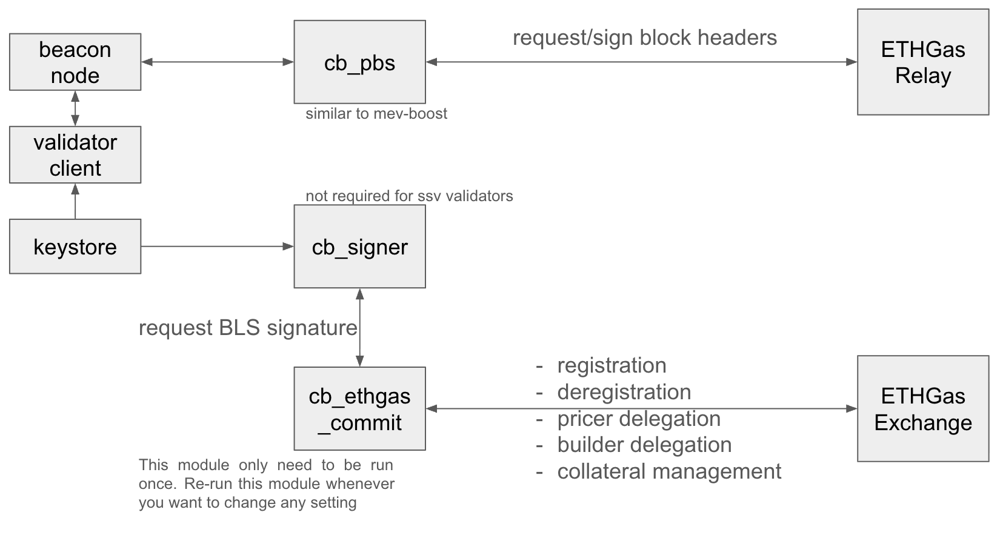

# ethgas-preconf-commit-boost-module

## Overview

First and foremost, we would like to give a big shout out to the Commit-Boost team for making Ethereum a more open and cooperative environment! This repo allows you to run all Commit-Boost components related to ETHGas in Docker. There are 3 main components, i.e.

- `cb_pbs`: It serves a similar purpose as MEV-Boost.
- `cb_signer`: It securely generates signatures from the validator BLS private keys. If you use remote signer or want to onboard DVT validators, you don't need this component.
- `cb_ethgas_commit`: It requests signatures for ETHGas registration from `cb_signer` where the signatures are then sent to the ETHGas Exchange via REST API
  
- For more details on ETHGas architecture, please refer to [here](https://docs.ethgas.com/our-technology/the-ethgas-architecture).

## Build docker images

- For `cb_ethgas_commit` and `cb_gen_jwt`, you can either use our pre-built linux/amd64 or linux/arm64 docker image or run `./scripts/build.sh` to build it locally.
- For `cb_signer` and `cb_pbs`, you can either use the official image from Commit Boost team or use Dockerfile [here](https://github.com/Commit-Boost/commit-boost-client/tree/main/provisioning) to build it locally.

## Get started

- [Node operators - Quick Start Guide](https://docs.ethgas.com/get-started/node-operators/quick-start-guide)
- [Node operators - Detailed Example Config - Mainnet](https://github.com/ethgas-developer/ethgas-preconf-commit-boost-module/blob/main/config.example.mainnet.toml)
- [Node operators - Detailed Example Config - Hoodi](https://github.com/ethgas-developer/ethgas-preconf-commit-boost-module/blob/main/config.example.hoodi.toml)
- [Additional Configuration Notes](./extra-config-notes.md)

## Audit

- The module has been audited by [Sigma Prime](https://sigmaprime.io). Find the report [here](https://github.com/ethgas-developer/ethgas-audit).

## Acknowledgements

- [Commit-Boost](https://github.com/Commit-Boost/commit-boost-client)

## If you need help...

- [ETHGas Doc](https://docs.ethgas.com)
- [ETHGas API Doc](https://developers.ethgas.com)
- [ETHGas X / Twitter](https://x.com/ETHGASofficial)
- [Commit-Boost Doc](https://commit-boost.github.io/commit-boost-client)

## License

MIT
